# 校园活动管理平台系统功能模块设计图

下图依据当前项目的 `README.md`、`app.json` 页面路由、`utils/api.js` 接口封装，以及 `pages/mine`、`managed-activities`、`organizer-checkin` 的实际角色入口整理，采用“系统平台 → 角色/公共域 → 模块组 → 具体功能”的四层结构展示系统功能，满足“按角色划分且功能结构不少于三层”的设计要求。

```mermaid
flowchart TB
  subgraph OVERVIEW["系统总览区"]
    SYS["校园活动管理平台"]
    COMMON_DOMAIN["公共/通用模块域"]
    ROLE_STUDENT["学生角色"]
    ROLE_ORGANIZER["组织者角色"]
    ROLE_ADMIN["管理员角色"]
  end

  SYS --> COMMON_DOMAIN
  SYS --> ROLE_STUDENT
  SYS --> ROLE_ORGANIZER
  SYS --> ROLE_ADMIN

  subgraph COMMON["公共/通用模块区"]
    COMMON_DOMAIN --> COMMON_PORTAL["门户访问模块"]
    COMMON_DOMAIN --> COMMON_AUTH["认证与账户模块"]
    COMMON_DOMAIN --> COMMON_PROFILE["个人资料模块"]

    COMMON_PORTAL --> HOME_REC["首页推荐与快捷入口"]
    COMMON_PORTAL --> ACTIVITY_BROWSE["活动浏览与筛选"]
    COMMON_PORTAL --> ACTIVITY_DETAIL["活动详情查看"]

    COMMON_AUTH --> LOGIN_REGISTER["登录 / 注册"]
    COMMON_AUTH --> WECHAT_LOGIN["微信登录"]

    COMMON_PROFILE --> PROFILE_EDIT["个人资料维护"]
    COMMON_PROFILE --> AVATAR_UPLOAD["头像上传"]
    COMMON_PROFILE --> PASSWORD_CHANGE["密码修改"]
  end

  subgraph STUDENT["学生功能区"]
    ROLE_STUDENT --> STU_PARTICIPATE["活动参与模块"]
    ROLE_STUDENT --> STU_ASSET["个人活动资产模块"]

    STU_PARTICIPATE --> STU_REGISTER["活动报名"]
    STU_PARTICIPATE --> STU_CANCEL["取消报名"]
    STU_PARTICIPATE --> STU_RECORDS["我的报名记录"]

    STU_ASSET --> STU_FAVORITE_OP["收藏 / 取消收藏活动"]
    STU_ASSET --> STU_FAVORITES["我的收藏"]
    STU_ASSET --> STU_TICKET["电子票查看"]
    STU_ASSET --> STU_QR["二维码 / 票码凭证展示"]
  end

  subgraph ORGANIZER["组织者功能区"]
    ROLE_ORGANIZER --> ORG_PUBLISH["活动发布模块"]
    ROLE_ORGANIZER --> ORG_OPERATE["活动运营模块"]
    ROLE_ORGANIZER --> ORG_MANAGER_ASSIGN["活动级授权模块"]

    ORG_PUBLISH --> ORG_CREATE["活动创建"]
    ORG_PUBLISH --> ORG_EDIT["活动编辑"]
    ORG_PUBLISH --> ORG_COVER["活动封面上传"]
    ORG_PUBLISH --> ORG_OPTIONS["发布选项配置"]
    ORG_PUBLISH --> ORG_REVIEW["提交审核"]

    ORG_OPERATE --> ORG_LIST["活动列表管理"]
    ORG_OPERATE --> ORG_REG_LIST["报名名单查看"]
    ORG_OPERATE --> ORG_CHECKIN["签到管理"]

    ORG_MANAGER_ASSIGN -.授予活动级权限.-> ACTIVITY_MANAGER["活动管理员（非平台角色）"]
    ACTIVITY_MANAGER --> MANAGER_VIEW["查看报名名单"]
    ACTIVITY_MANAGER --> MANAGER_SCAN["扫码签到"]
    ACTIVITY_MANAGER --> MANAGER_MANUAL["手动票码核销"]
  end

  subgraph ADMIN["管理员功能区"]
    ROLE_ADMIN --> ADMIN_REVIEW["审核管理模块"]
    ROLE_ADMIN --> ADMIN_AUDIT["审核记录模块"]

    ADMIN_REVIEW --> ADMIN_PENDING["待审核活动列表"]
    ADMIN_REVIEW --> ADMIN_APPROVE["审核通过"]
    ADMIN_REVIEW --> ADMIN_REJECT["审核驳回"]
    ADMIN_REVIEW --> ADMIN_TASK["审核任务处理"]

    ADMIN_AUDIT --> ADMIN_COMMENT["审核意见 / 审计记录"]
  end
```

## 设计说明

- 平台基础角色仅包括学生、组织者、管理员三类，对应后端 `UserRole` 枚举：`STUDENT`、`ORGANIZER`、`ADMIN`。
- “活动管理员”不是平台注册角色，而是组织者在单个活动范围内授予的活动级权限；其对应后端 `ActivityManagerPermission` 枚举仅包含 `VIEW_REGISTRATIONS` 与 `CHECK_IN` 两项能力。
- 图中“活动管理员”只放在组织者功能区下展示，用于体现 `managed-activities`、`managed-registrations`、`organizer-checkin` 这类活动级管理入口，不单独提升为平台角色。
- 图中功能名称仅覆盖当前前后端已经形成闭环的能力，不纳入仅存在于数据库实体、基础设施或预留模型中的内容，例如表结构、令牌、日志等技术实现细节。
- 图中功能可追溯到现有实现：
  - 页面：`index`、`activity-list`、`activity-detail`、`my-registrations`、`my-favorites`、`ticket`、`organizer-activities`、`activity-managers`、`managed-activities`、`managed-registrations`、`organizer-checkin`、`admin-review`
  - 接口域：`auth`、`activities`、`registrations`、`users`、`organizer/activities`、`admin/reviews`
